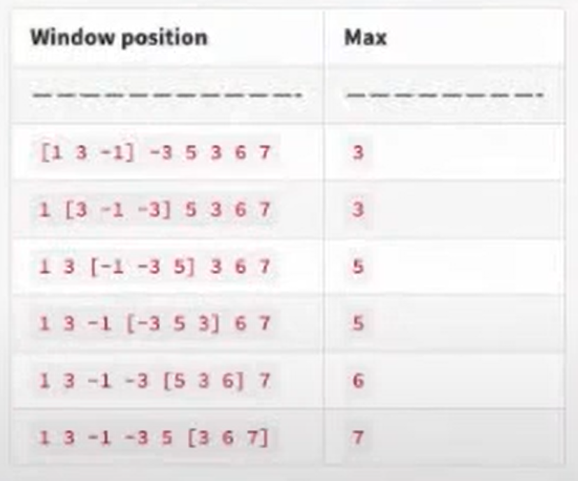

# Problem Description
Given an array of integers A. There is a sliding window of size B which is moving from very left of the array to the very right.
You can only see the w numbers in the window. Each time the sliding window moves rightwards by one position, you have to find the maximum for each window.

# Example
```javascript
Input = [1, 3, -1, -3, 5, 3, 6, 7]
B = 3
```

## Output
