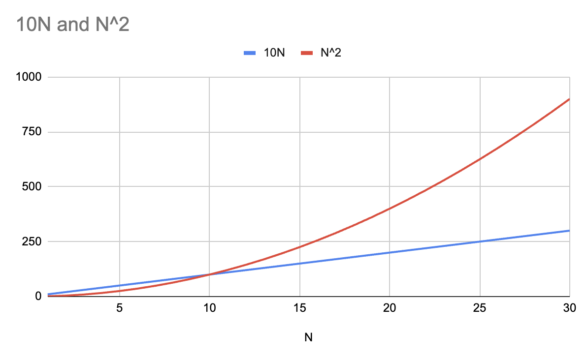
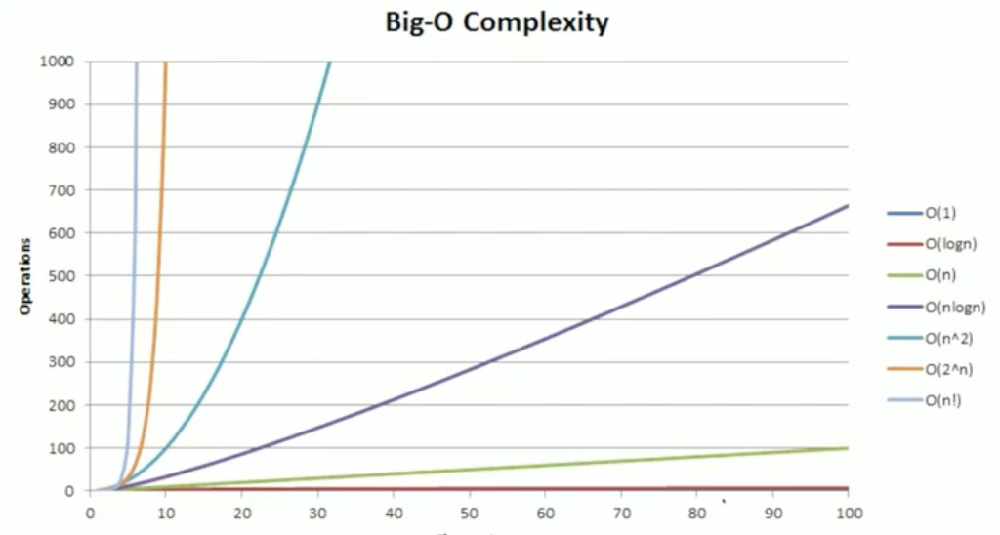

# Introduction

- Array is one of the simplest data structures
- They are most fundamental and basic data structure
- Time and space complexity are important - you only do this during the interview

# What is Big O

- Representation of time and space requirements of an algorithm based on the input
- does not tell you how many CPU cycles required
- It is meant to generalize the growth of your algorithm
- O(n) = your algorithms execution time and memory increases with the increase in size of the input.
- Why should we use Big O notation?
    * helps us identify why or why not use a particular algorithm
    * Knowing how the algorithm will perform will help shape the performance of the application
- To say simply, as your input grows - how fast does computation and memory grow?


```
function sum_char_codes(n) {
    let sum = 0;
    for(let i = 0; i < n.length; i++) {
        sum+= n.charCodeAt(i);
    }

    return sum;
}
```

Above code has linear O(n) time and space complexity. As the input grows, the computation and memory required grows. This is the way to describe what is the running time of this code.

# Important Concepts

## Growth
Growth is with respect to input.

In real world, memory growing is not computaitonally free but in the matter of thinking about algorithm, we don't necessarily think about that. Some programming languages cause heavy penalties as memory that keeps growing may be kept around and may bring the program to a complete halt.


### Example
```
function sum_char_codes(n) {
    let sum = 0;
    for(let i = 0; i < n.length; i++) {
        sum+= n.charCodeAt(i);
    }

    return sum;
}
```

- In the above code, how does the execution time of our program grow with respect to input size?
-  For loop has to be executed for the length of the string. So if the string grows by 50%, how much slower is our program going to be?
- For every one more character of the string there is one more loop that is has to execute.
- Hence, O(n)
- How do you tell that it would be "n"?
- Simplets trick for the complexity is *look for loops*

## Drop the constants

### Example
```
function sum_char_codes(n) {
    let sum = 0;
    for(let i = 0; i < n.length; i++) {
        sum+= n.charCodeAt(i);
    }

    for(let i = 0; i < n.length; i++) {
        sum+= n.charCodeAt(i);
    }

    return sum;
}
```
- What's the running time of above code?
- O(2n) ---> O(n)
- Growth is with respect of input
- The Big O is meant to describe the upper bound of the algorithm.
- The constant eventually becomes irrelevant
- Look at below example:

N = 1,      O(10N) = 10,        O(N^2) = 1
N = 5,      O(10N) = 50,        O(N^2) = 25             <---- nestedloop is efficient
N = 10,     O(10N) = 100,       O(N^2) = 100            <---- same
N = 100,    O(10N) = 1000,      O(N^2) = 10000          <---- 10xBigger
N = 1000,   O(10N) = 10,000,    O(N^2) = 1,000,000      <---- 100xBigger
N = 10000,  O(10N) = 100,000,   O(N^2) = 1,0000,0000    <---- 1000xBigger

- N^2 just grows massively larger than 10N. It grows disproportionately fast as compared to whatever the constant is in front of it.



- Since we are not trying to get an exact time, constants are not that important.

### Practical vs Theoretical differences
- Just because N is faster than N^2, doesn't mean practically it's always faster for smaller input.
- Compare O(100N) vs O(N^2)
- Smaller than 10 input is faster for O(N^2) as compared to O(100N);
- O(100N) is faster than O(N^2) just because we drop inputs
- In Sorting algorithms, Insertion Sort (O(N^2)) vs Quick Sort (O(logN)), Insertion Sort is faster for smaller inputs than Quick Sorts.
- i.e. N^2 is smaller sometimes than 10N (see the graph)

## Consider Worst Case
```
function sum_char_codes(n) {
    let sum = 0;
    for(let i = 0; i < n.length; i++) {
        const charCode = n.charCodeAt(i);
        if (charCode === 69) {
            return sum
        }

        sum+= n.charCodeAt(i);
    }

    return sum;
}
```
- What is the worst case here?
- We can encounter E at the beginning or at the very end of the string
- It is still O(N)
- 2 characters from the N length, O(N-2) ---> O(N)
- Interviews rarely ask average or best case scenarios

# All the Big-O Complexities


- O(1) = Constant time
- O(logN)
- O(N) = linear
- O(NlogN)
- O(N^2)
- O(2^N)
- O(N!) = steapest

Last 2 basically cannot run on a normal computer. You can't solve Travelling Salesman Problem for 12 cities...

# More Examples
```
function sum_char_codes(n) {
    let sum = 0;
    for(let i = 0; i < n.length; i++) {
        for(let j = 0; i < n.length; j++) {
            sum+= n.charCodeAt(j);
        }
    }

    return sum;
}
```
- Above code is O(N^2) because you need to count the number of loops
```
function sum_char_codes(n) {
    let sum = 0;
    for(let i = 0; i < n.length; i++) {
        for(let j = 0; i < n.length; j++) {
            for(let k = 0; i < n.length; k++) {
                sum+= n.charCodeAt(k);
            }
        }
    }

    return sum;
}
```
- Above code is O(N^3)
- This is like multiplying a matrices
- We will see O(NlogN) QuickSort Algorithm <--- You reduce the search space by half each time and search across the entire half space
- O(logN) algorithm, Binary Search <---- You reduce the search space by half each time and look for one point only
- Craziest time which does not get mentioned O(squareRoot(N))
- Focus on the technical understanding of the algorithm rather than knowing if it takes O(N) or O(N^2). Keep it as a bi-product of running algorithms.
- Big O is the upper bound. There is theta, there is omega. 
- Sometimes, people don't care about space or time. 