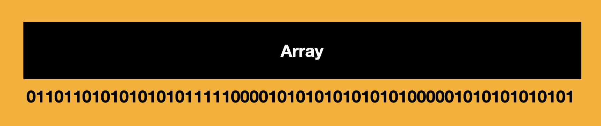
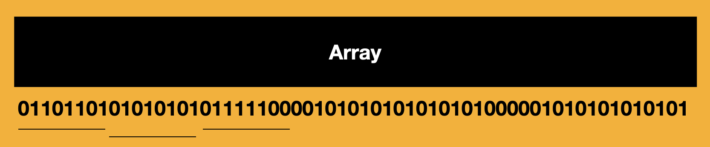

# Misconception of Arrays vs List

- What we traditionally refer as arrays are Lists
- Arrays are nothing but continuous series of bits interprited differently based on our needs
- Array is a data structure, not an algorithm

```
const a = [];
```

- Above code is not an array. It is continuous series of bits
- What is `const a = []` if it is not an array?
- JavaScript arrays do a lot of cool things underneath the hood
- They do a lot of smart stuff to manage the memory under the hood, say a billionth element is assigned would not cause the JavaScript to allocate so much memory for empty elements.

# Fundametal Idea of an Array
- Contiguous memory space
- Contiguous meaning unbreaking memory space



- How memory is interpreted is how you tell the compiler to interpret it to
- The compiler tries to understand the type of the data it is trying to access and based on that it says that it is either a 32 bit or 16 bit number


- In more traditional languages we could say `a = int[3]` i.e. I want an array of integers of size 3.
- a[0] is interpreted as **Go the the memory address of "a" and then add index "0" multiply by the size of the value to actually get the value stored at that address**
- Index 1 has to start after address of a + 1*size of data
- Hence array is nothing but a simple contiguous space

```
const a = new ArrayBuffer(10);
console.log(a);

const a8 = new Uint8Array(a);
console.log(a8);

a8[0] = 45;
console.log(a);

a8[1] = 45;
console.log(a);

const a16 = new Uint16Array(a);
a16[2] = 45000;
console.log(a);
```

```
const a = new ArrayBuffer(10);
console.log(a);

const a8 = new Uint8Array(a);
console.log(a8);

a8[0] = 45;
console.log(a);

a8[1] = 45;
console.log(a);

const a16 = new Uint16Array(a);
a16[2] = 45000;
console.log(a);
```

- This is just to set the mindset that array is nothing but a contiguous memory
- Time taken to access a value is constant time i.e. O(1) because we know the address and we do not need to traverse through the entire memory. We know the starting position of the memory and we know the index. Hence we can pin point to the location we want to go to. Even if we have billion elements, we have constant time to access, push, pop or delete a value.
- Insertion at a specific address = overrite the memory and shift other elements to a new memeory. Some languages have capacity built in so they do not have to manage values in the memory when something is inserted at a specific address.
- Deleting at a specofic index is also setting it to a null or 0 value with a constant time

# Arrays
- They are fixed, contiguous memory chunks
- You cannot grow it
- There is no inserAt or push or pop methods. JS provides you these sugar syntactical benifits.
- Create, insert and delete are implemented over the top of an array
- Static or traditional arrays dont have these methods, like in C.
